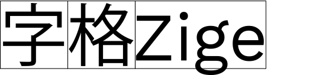
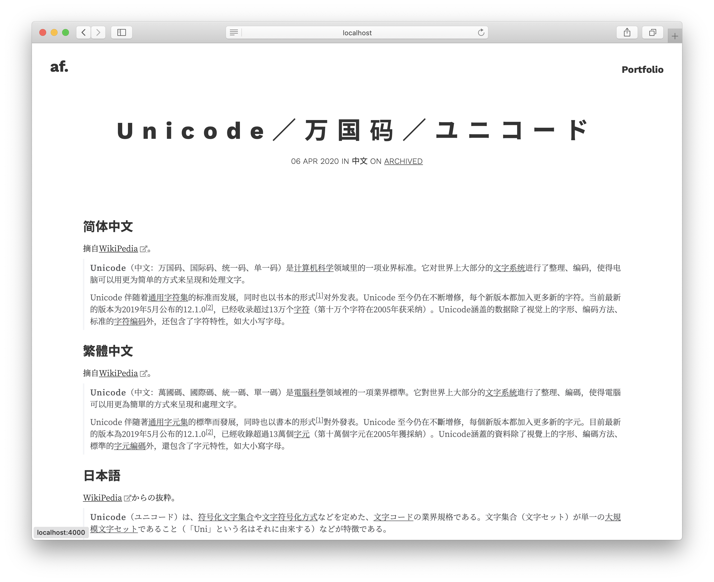
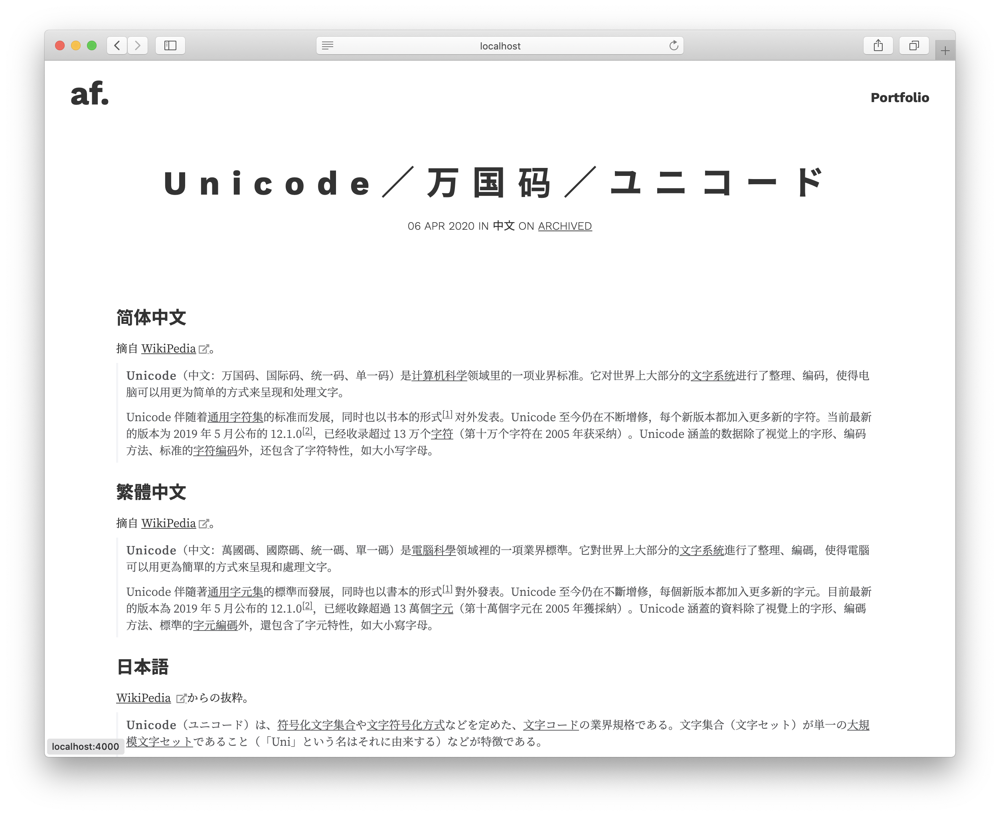

<h1>Zige 字格</h1>

<p>
<a href="https://cdn.jsdelivr.net/gh/zhenalexfan/zige.js/release/zige.min.js">
    
</a>
<a href="LICENSE">
    
</a>
</p>

<p width="400px">

</p>

## What is it

In typography, spacing adjustments are needed between characters, which is also called [kerning](https://en.wikipedia.org/wiki/Kerning). However, modern web (or most operating systems) fails to do it properly when [CJK characters (漢字, ひらがな, カタカナ)](https://en.wikipedia.org/wiki/CJK_characters) and Latin letters are mixed up in a webpage. If you also feel upset about it when building a webpage and agree that ["the space bar is not a design tool"](https://web.archive.org/web/20110319053039/https://hungermtn.org/the-space-bar-is-not-a-design-tool/), Zige enables you to have better spacings between CJK and latin characters, without changing the text content itself (i.e. not by adding any [whitespace characters](https://en.wikipedia.org/wiki/Whitespace_character)!) in your webpage, by just adding one line of code.

<div align="center">


<br>
<p>A blog post example before & after using Zige</p>
</div>

## How to use

1. Add `zige.min.js` to the `<head>` tag of your webpage.

``` html
<script src="https://cdn.jsdelivr.net/gh/zhenalexfan/zige.js/release/zige.min.js"></script>
```

2. You're done if you would like to apply Zige to your whole webpage! If you hope it to be on some specific parent elements only, add `class="zige"` to these parent elements. Applying it only on the CJK-language elements could improve the performance. Below is an example.

``` html
<div class="zige"> <!-- Zige is applied to all the child elements in this div -->
    <p>ウィキペディア日本語版は<a>2001年</a>5月頃に発足したものの⋯⋯</p>
</div>
```

3. If you hope to do more customizations on e.g. the size of the spacing (0.25em by default), the class name, ect., read the Development section below.  

## Development

Edit the following variables in `zige.js` to make corresponding customizations.

|Variable Name   	|Comment   	|
|---	|---	|
|`CLASS_NAME`   	|Class name (`zige` by default) on the root elements for which spacing is generated.    |
|`SPAN_ATTR_NAME`   |Attribute name (`zige-margin` by default) used on the span elements wrapping the alphabet subcontext inside the CJK context. 	|
|`DEFAULT_AUTO_MARGIN_SIZE`  	|Margin size (`0.25em` by default) of the alphabet subcontext inside the CJK context.  	|
|`CJK_SCRIPT`   	|Regex to match all CJK ideographs. *Might need to be extended for more special usages.*   	|
|`CJK_SYMBOL`   	|Regex to match all CJK symbols and punctuations, including [general punctuations](https://www.unicode.org/charts/PDF/U2000.pdf) used in both CJK context and alphabet context. *Might need to be extended for more special usages.*   	|
|`ALPHABET_SCRIPT`   	|Regex to match all Latin letters. *Might need to be extended for more special usages.*   	|
|`ALPHABET_SYMBOL`      |Regex to match all Latin punctuations, including [general punctuations](https://www.unicode.org/charts/PDF/U2000.pdf) used in both CJK context and alphabet context. *Might need to be extended for more special usages.*      |

### How Zige works

Zige wraps Latin subcontexts in CJK contexts with `<span>` tags and adds CSS `margin`s to them. 

This solution was inspired by answers under [this Zhihu question](https://www.zhihu.com/question/19587406) that I have followed since around 2013, especially the answers from [钱争予](https://www.zhihu.com/question/19587406/answer/12863476) and [千鸟](https://www.zhihu.com/question/19587406/answer/12298384). 

While I don't believe this is the ultimate solution to the kerning problem in typesetting characters from multi-writing systems since it should be solved by fonts and operating systems, it could be a better soluton on web before the best things happen. 

If you think the matching rules can be improved for more different characters or have any issue, welcome to submit a pull request, create an issue or [email me](mailto:zhenalexfan@gmail.com)! 